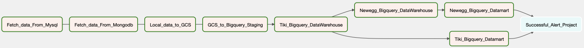
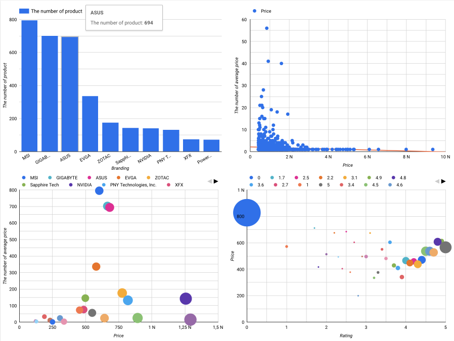
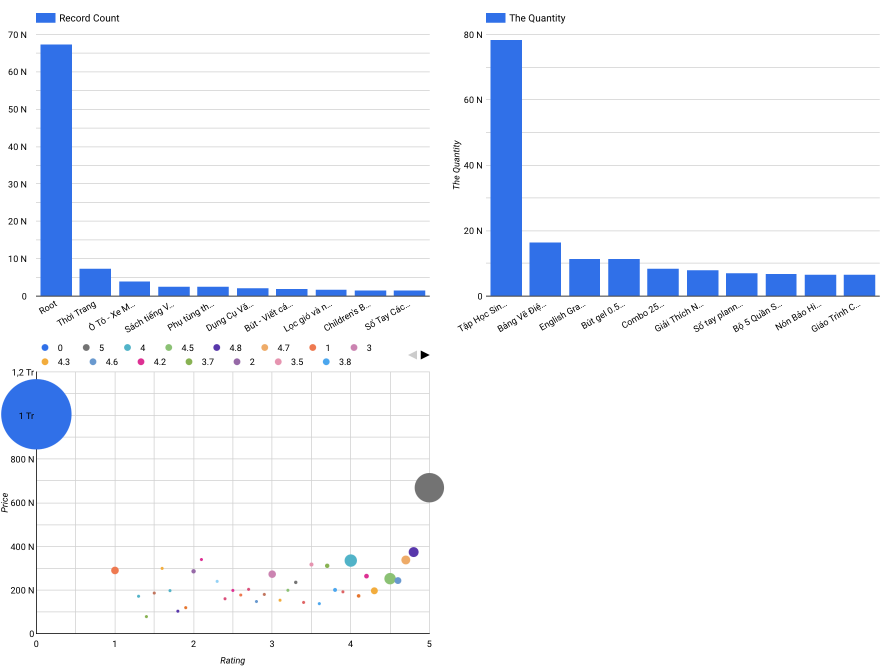

# Build a production level ETL pipeline platform using apache Airflow 

This repository contains code for building a production-level ETL pipeline using Apache Airflow. The pipeline extracts data from various sources (Mongodb, Mysql), transforms it, and loads it into a data warehouse and datamart for business analytic.

## Getting Started

Follow the steps below to set up and run the ETL pipeline.

### Prerequisites

- **Apache Airflow Installation:** Apache Airflow is properly installed on virtual machine.
- **Database Systems:** Have both Mongodb and Mysql databases installed and properly configured. These databases will serve as sources for data within your ETL process.
- **Google Cloud SDK (gsutil):** Install and configure the gsutil command-line tool provided by the Google Cloud SDK.
- **Google Cloud Services Setup:** Create and set up the necessary Google Cloud resources:
    - **Virtual Machine (VM)**: Provision a virtual machine instance on Google Cloud.
    - **Google Cloud Storage (GCS)**: Create the required buckets for storing your data.
    - **Google BigQuery**: Set up and configure a BigQuery dataset to serve as your data warehouse.

### Installation and Configuration

- **Virtual Machine (VM):** Ensure that you have a virtual machine instance set up with the appropriate OS and environment for running your ETL tasks.
- **Database Configuration:** Install and configure both Mongodb and Mysql databases on your virtual machine. Make sure to have the necessary connection parameters ready.
- **Google Cloud Setup:** Install and initialize the Google Cloud SDK on your virtual machine. This will provide access to the gsutil command-line tool, which is crucial for interacting with Google Cloud services.

### Process in the Pipeline

**Main DAGs:**
[Main.py](./src/dags/main.py)

#### Configuration

- **Owner:** Duong
- **Start Date:** August 11, 2023
- **Schedule Interval:** Daily at 7:00 AM
- **Number of Retries:** 3 times
- **Interval between Retries:** 5 minutes

The ETL-Airflow-Process DAG handles the following tasks in an end-to-end ETL pipeline:

1. __Collect Data:__ [Extract_Data.py](./src/plugin/Extract_Data.py)
- **MySqL_Fetch_data**: Extracts data from MySQL.
- **Mongodb_Fetch_data**: Extracts data from MongoDB.
- **Local_data_to_GCS**: Transfers fetched data to Google Cloud Storage (GCS).
2. __Data Warehouse:__ [Transform_Data.py](./src/plugin/Transform_Data.py)
- **GCS_to_Bigquery_Staging:** Loads staged data into BigQuery Data Staging.
- **Tiki_Bigquery_DataWarehouse:** Transforms data from Data Staging and loads Tiki data into BigQuery
(Sql query: [Sql_Queries.py](./src/plugin/Sql_Queries.py)).
- **Newegg_Bigquery_DataWarehouse:** Transforms data from Data Staging and loads Newegg data into BigQuery
(Sql query: [Sql_Queries.py](./src/plugin/Sql_Queries.py)).
4. __Datamart Creation:__ [Load_Data.py](./src/plugin/Load_Data.py)
- **Tiki_Bigquery_Datamart:** Transform data into Tiki DataMart
(Sql query: [Sql_Queries.py](./src/plugin/Sql_Queries.py)).
- **Newegg_Bigquery_Datamart:** Transform data into Tiki DataMart
(Sql query: [Sql_Queries.py](./src/plugin/Sql_Queries.py)).
5. __Alert:__ 
- **Successful_Alert_Project:** Sends email success alert.
- **Failed_Alert:** Sends email failed alert.

**Daily report at 7 am in Data Studio:**
- **Newegg daily report:**

- **Tiki daily report:** 

